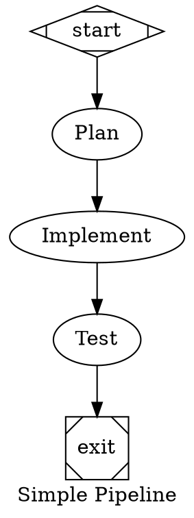
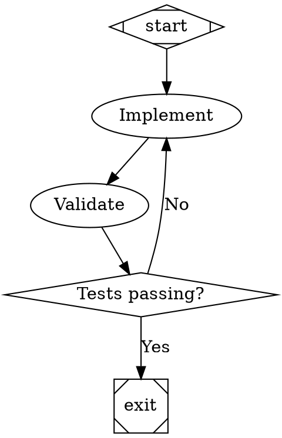
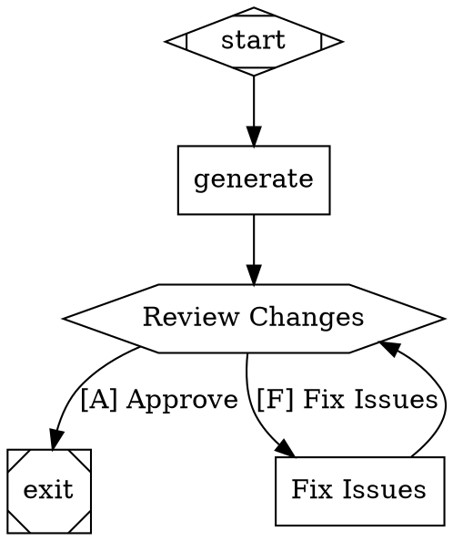

# Corey's Attractor

[](LICENSE)

> **Based on the fantastic work from [StrongDM's Software Factory](https://factory.strongdm.ai/) and the [Attractor project](https://github.com/strongdm/attractor).**
>
> StrongDM built a software factory — an automated development system where AI agents write code, run validation, and improve continuously without humans writing or reviewing code. Attractor is the core orchestration engine that makes this possible: a pipeline runner where you define workflows as directed graphs (using [Graphviz DOT](https://graphviz.org/doc/info/lang.html) format) and Attractor executes them, dispatching work to LLMs, waiting on human gates, and routing conditionally between branches.
>
> The name "Attractor" comes from dynamical systems theory — an attractor is a state or pattern that a system naturally converges toward over time. In the context of agentic pipelines, the idea is that well-defined goal-oriented graphs will pull the AI's execution toward a desired outcome, even across retries, branches, and failures. Rather than scripting every step imperatively, you describe the shape of the solution and let the system find its way there.
>
> This repository is a personal implementation of that concept, built as a learning project to explore agentic workflow orchestration.

A DOT-based pipeline runner that orchestrates multi-stage AI workflows. You define pipelines as directed graphs in [Graphviz DOT](https://graphviz.org/doc/info/lang.html) format, and Attractor executes each node by dispatching work to an LLM, waiting for human review, running parallel branches, or following conditional edges — all observable in real time through a built-in web dashboard.

## Features

- **DOT pipelines** — define workflows as `.dot` directed graphs; nodes are tasks, edges are transitions
- **LLM integration** — nodes call Anthropic Claude, OpenAI GPT, or Google Gemini based on configuration
- **Conditional branching** — edges carry `condition=` attributes that route execution based on node outcomes
- **Parallel execution** — fan-out / fan-in nodes run multiple branches concurrently
- **Human gates** — `type="wait.human"` nodes pause execution for interactive approval/rejection
- **Retry & back-off** — configurable per-node retry policy with exponential back-off
- **Persist & resume** — run state is stored in SQLite; crashed runs can be resumed from checkpoints
- **Web dashboard** — real-time SSE-powered UI at `http://localhost:7070`; supports multiple concurrent pipelines; upload `.dot` files via the browser

## Requirements

- **Java 21** (Gradle 8.7 is incompatible with Java 25+)
- Gradle 8.7 (wrapper included, or use the system Gradle)

## Build

Set Java 21 as the active JDK:

```bash
export JAVA_HOME=/opt/homebrew/opt/openjdk@21/libexec/openjdk.jdk/Contents/Home
```

Build the fat jar:

```bash
# Using the system Gradle (recommended)
~/.gradle/wrapper/dists/gradle-8.7-bin/*/gradle-8.7/bin/gradle -p . jar

# Or using the wrapper (requires Java 21)
./gradlew jar
```

The output jar is written to `build/libs/coreys-attractor-1.0.0.jar`.

## Run

```
java -jar build/libs/coreys-attractor-1.0.0.jar [options]
```

### Options

| Flag | Description |
|------|-------------|
| `--logs-root <dir>` | Directory for logs and artifacts (default: `logs/<name>-<timestamp>`) |
| `--web-port <n>` | Web interface port (default: `7070`) |

### Environment Variables

| Variable | Description |
|----------|-------------|
| `ANTHROPIC_API_KEY` | API key for Anthropic Claude |
| `OPENAI_API_KEY` | API key for OpenAI GPT |
| `GEMINI_API_KEY` | API key for Google Gemini |
| `ATTRACTOR_DEBUG` | Set to any value to enable debug output and stack traces |

### Examples

```bash
# Start the web interface
java -jar build/libs/coreys-attractor-1.0.0.jar

# Use a non-default port
java -jar build/libs/coreys-attractor-1.0.0.jar --web-port 8080

# Use a custom logs directory
java -jar build/libs/coreys-attractor-1.0.0.jar --logs-root /tmp/my-runs
```

Then open `http://localhost:7070` (or your chosen port) in a browser to watch the pipeline execute.

## Pipeline Format

Pipelines are written in Graphviz DOT. Attractor interprets node shapes and attributes to decide how each node is executed.

### Node types

| Shape / Attribute | Behavior |
|-------------------|----------|
| `shape=Mdiamond` | Start node |
| `shape=Msquare` | Exit node |
| `shape=box` (default) | LLM prompt node — `prompt=` attribute is sent to the configured model |
| `shape=diamond` | Conditional gate — evaluates outgoing edge `condition=` attributes |
| `shape=hexagon` or `type="wait.human"` | Human review gate — pauses for interactive input |
| Parallel / fan-out nodes | Multiple outgoing edges from a single node run concurrently |

### Edge attributes

| Attribute | Description |
|-----------|-------------|
| `label` | Display label shown in the dashboard |
| `condition` | Boolean expression evaluated against the upstream node's outcome (e.g. `outcome=success`, `outcome!=success`) |

### Graph attributes

| Attribute | Description |
|-----------|-------------|
| `goal` | A natural-language goal string interpolated into prompts via `$goal` |
| `label` | Display name for the pipeline |

### Examples

**Linear pipeline** (`examples/simple.dot`):


**Conditional retry loop** (`examples/branching.dot`):


**Human review gate** (`examples/human-review.dot`):


## Web API

The dashboard exposes a small HTTP API for programmatic use:

| Method | Path | Description |
|--------|------|-------------|
| `GET` | `/` | Dashboard UI |
| `GET` | `/api/pipelines` | List all pipeline states (JSON) |
| `POST` | `/api/upload` | Submit a new pipeline — body: `{dotSource, fileName, simulate, autoApprove}` |
| `POST` | `/api/pause` | Pause a running pipeline — body: `{id}` |
| `POST` | `/api/resume` | Resume a paused pipeline — body: `{id}` |
| `GET` | `/events` | SSE stream of all pipeline state updates |

## Project Structure

```
src/main/kotlin/attractor/
├── Main.kt                  # CLI entrypoint
├── dot/                     # DOT parser and graph model
├── engine/                  # Execution loop, retry policy
├── handlers/                # Node handlers (LLM, human, parallel, conditional, …)
├── llm/                     # LLM provider clients (Anthropic, OpenAI, Gemini)
├── web/                     # HTTP server, SSE, dashboard, pipeline registry
├── db/                      # SQLite persistence (RunStore)
├── condition/               # Edge condition evaluator
├── lint/                    # Pipeline linting
└── state/                   # Run state model
examples/                    # Sample .dot pipelines
```

## Running Tests

```bash
export JAVA_HOME=/opt/homebrew/opt/openjdk@21/libexec/openjdk.jdk/Contents/Home
./gradlew test
```

## License

Licensed under the [Apache License, Version 2.0](LICENSE).

---

## Disclaimer

> **This entire codebase — including this README — was generated by AI.**
>
> Use it at your own risk. No guarantees are made about correctness, security, stability, or fitness for any purpose. This is a personal learning project and should not be used in production without thorough review and testing.
