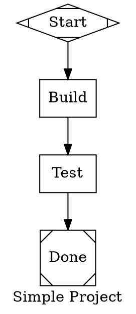
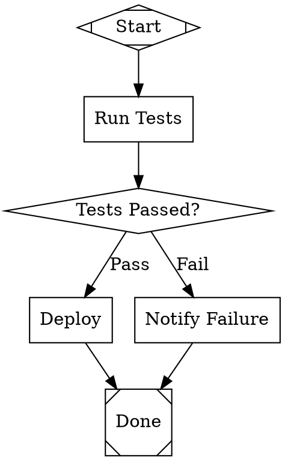
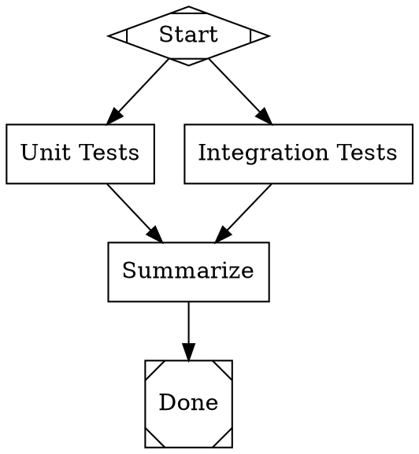
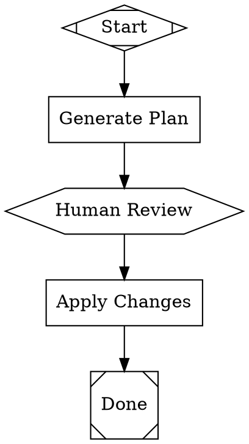

## Overview

Attractor projects are defined using the [Graphviz DOT language](https://graphviz.org/doc/info/lang.html), extended with Attractor-specific node and graph attributes. A project is a directed graph where each node represents an execution stage and each edge represents a transition.

> **Tip:** The Create view can generate a valid DOT project from a natural language description. Use it as a starting point, then customize.

## Node Types

| Shape / Type | Role | Description |
|--------------|------|-------------|
| `shape=Mdiamond` | **Start** | Project entry point. Every project must have exactly one start node. |
| `shape=Msquare` | **Exit** | Project terminal. Every project must have at least one exit node. |
| `shape=box` (default) | **LLM Stage** | The `prompt` attribute is sent to the configured LLM. The model's response becomes the stage output. |
| `shape=diamond` | **Conditional Gate** | Evaluates outgoing edge `condition` attributes to choose the next stage. |
| `shape=hexagon` or `type="wait.human"` | **Human Review Gate** | Pauses the project and waits for an operator to approve or reject. |
| Multiple outgoing edges | **Parallel Fan-out** | When a non-conditional node has multiple outgoing edges, all target nodes run concurrently. |
| `shape=component` | **Parallel Fan-out** *(explicit)* | Marks this node explicitly as a parallel fan-out point. All outgoing edges run their target nodes concurrently. Makes the intent unambiguous in the graph source. |
| `shape=tripleoctagon` | **Parallel Fan-in** | Waits for all concurrent branches to complete before continuing. Use as the merge/join point after a `component` fan-out node. |
| `shape=parallelogram` | **Tool Node** *(advanced)* | Executes a deterministic shell command (`tool_command`) in the run workspace (`<logsRoot>/workspace`) rather than dispatching an LLM prompt. |
| `shape=house` | **Stack Manager Loop** *(advanced)* | Manages a loop that delegates sub-tasks to a stack-based manager agent. Useful for iterative or recursive workflow patterns. |

## Node Attributes

| Attribute | Type | Description |
|-----------|------|-------------|
| `label` | string | Display name shown in the dashboard and graph view. Defaults to the node ID. |
| `prompt` | string | LLM instruction for this stage. Required for LLM stage nodes. |
| `shape` | string | Determines node behavior. See Node Types above. |
| `type` | string | Extended type override. Currently: `"wait.human"` for human review gates. |
| `llm_provider` | string | Optional provider override per stage (`openai`, `anthropic`, `gemini`, `copilot`, `custom`). |
| `llm_model` | string | Optional model override per stage. If omitted, Attractor uses the provider default. |

## Edge Attributes

| Attribute | Type | Description |
|-----------|------|-------------|
| `label` | string | Display label shown in the graph view. |
| `condition` | string | Boolean expression evaluated at a conditional gate. Supports `=`, `!=`, `contains`, `!contains`, and `&&`. Example: `outcome=success`, `context.last_response contains "approved"`. |

## Graph Attributes

| Attribute | Description |
|-----------|-------------|
| `goal` | Project description shown in the dashboard Overview panel. |
| `label` | Project display label used in the graph title. |

## Annotated Examples

### 1. Simple linear project

### 2. Conditional branch

### 3. Parallel fan-out

### 4. Human review gate

## Tips

- Validate your DOT before running: `POST /api/v1/dot/validate` or `attractor dot validate --file project.dot`
- Render to SVG locally: `dot -Tsvg project.dot -o project.svg` (requires Graphviz)
- Node IDs must be valid DOT identifiers (alphanumeric + underscore, no hyphens as first character)
- Stage `prompt` text can reference previous stage context — the runtime maintains a conversation history
- The `simulate=true` option runs the project without real LLM calls (useful for graph testing)
